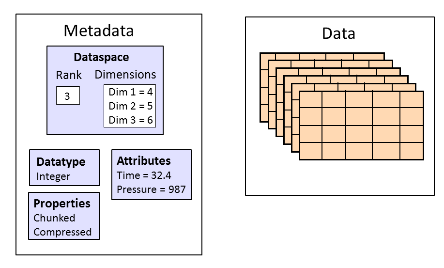

# Self study module on HDF5

HDF5 is a file format that has become popular in scientific and industrial computing due to its flexibility, I/O performance and portability.

These notes give an introduction to the HDF5 file format and its C/Fortran API.
We will cover the following:
- Creating and writing HDF5 datasets into a file
- Writing metadata for the datasets
- Investigating HDF5 file contents with command line tools
- Writing to HDF5 file from multiple MPI processes
- Using HDF5 hyperslabs to selectively operate on parts of a dataset

You can find the official HDF5 documentation [here](https://support.hdfgroup.org/documentation/hdf5/latest/index.html). Especially useful are the User Guide and Reference Manual tabs.

## Code examples and exercises

The HDF5 API provides functions for creating and manipulating HDF5 files and datasets within them. The API is very flexible, giving the programmer full control over how datasets should be created or accessed. The price to pay for this flexibility is that the programming interface is rather verbose and abstract. For example, many API calls allow the programmer to configure their behavior by passing **HDF5 Property List** objects as function argument, but in many cases the default behavior is sufficient in which case we instead pass `H5P_DEFAULT`.

Most API functions that create HDF5 state (eg. file or dataset creation) return an integer identifier of type `hid_t` to the created resource, instead of returning a direct pointer to it. Likewise, functions that operate on HDF5 objects take in these IDs, or **handles**, as arguments. This is a somewhat common way of hiding implementation details of library objects or structs from the programmer.

There are example programs and code exercises associated with these notes.

TODO:
- mention here that we use C-style API
- C++ users may find the C++ bindings useful
- Mention simplified HDF5 API
- mention h5py

## HDF5 file structure

HDF5 files are binary files intended for storing arbitrary N-dimensional datasets, where each element in the dataset may itself be a complex object ("heterogeneous data").
There is no limit on how big the datasets can be; HDF5 can hold arbitrarily large amounts of data.
HDF5 has a complex, filesystem-like structure that allows one file to hold many datasets in an organized fashion.

  
*HDF5 file structure. "Groups" are analogous to directories on a Unix-like filesystem, and datasets then correspond to files.*


The HDF5 data model separates the **shape** of data from the dataset itself. Data shape (number of rows, columns etc.) in HDF5 is called a **dataspace**. Dataspaces and datasets must be managed separately by the programmer, and creation of a dataset requires a valid dataspace.
- Analogy from Python: `numpy` arrays and their `numpy.shape` objects.

  
*Example HDF5 dataset and its metadata. Image taken from https://portal.hdfgroup.org/documentation/hdf5/latest/_intro_h_d_f5.html.*

The minimal steps for creating an HDF5 file and writing a dataset to it are as follows:
1. Create the file using [`H5Fcreate()`](https://docs.hdfgroup.org/archive/support/HDF5/doc/RM/RM_H5F.html#File-Create), with appropriate creation flags and configuration options.
2. Create a [**dataspace**](https://support.hdfgroup.org/documentation/hdf5/latest/group___h5_s.html#ga8e35eea5738b4805856eac7d595254ae) to represent shape of the data. Usually we are interested in writing N-dimensional arrays; dataspaces corresponding to these are called "simple" in HDF5. A simple dataspace can be created with [`H5Screate_simple()`](https://support.hdfgroup.org/documentation/hdf5/latest/group___h5_s.html#ga8e35eea5738b4805856eac7d595254ae) in which we specify the dimensionality and number of elements along each dimension.
3. Create a [**dataset**](https://support.hdfgroup.org/documentation/hdf5/latest/_h5_d__u_g.html) by calling [`H5Dcreate()`](https://docs.hdfgroup.org/archive/support/HDF5/doc/RM/RM_H5D.html#Dataset-Create). In this function call we specify which file this dataset is to be created in, type of data that we are storing (eg. integers of floats), and a valid dataspace for defining dataspace shape.
4. Call [`H5Dwrite()`](https://docs.hdfgroup.org/archive/support/HDF5/doc/RM/RM_H5D.html#Dataset-Write) to write data to into the dataset. We have to specify the target dataspace, type of data to be written and a valid pointer to memory address where the source data resides. We must also pass _two_ dataspaces for specifying shapes of source and target data:
    - A "memory space" or **memspace**, which defines how the source data is aligned in memory. This is like specifying the number of elements to get starting from the input memory address in "standard" I/O routines. If the source data is contiguous and has same logical shape as the dataspace used by the dataset, we may use the special keyword `H5S_ALL`; otherwise a valid memspace must be manually created (via `H5Screate_simple()`) and passed to `H5Dwrite()`.
    - A "file space", which is an another dataspace object specifying where in the dataset the data should be written to. Passing `H5S_ALL` means we write the full memspace.
A more detailed specification of memspace and file space semantics can be found in the documentation linked above.

This is a lot of programming overhead just for outputting data to a file! For simple writes most of this machinery is indeed unnecessarily complicated, but becomes very useful when working with complex or parallel data.

### Writing metadata via HDF5 attributes

HDF5 [**attributes**](https://portal.hdfgroup.org/documentation/hdf5/latest/_h5_a__u_g.html) are a special data structure intended for storing metadata. Metadata *could* be stored as standard HDF5 datasets, however this can be inefficient because metadata is usually small compared the actual data. HDF5 attributes are similar to datasets, but optimized for small metadata that can be *attached* to datasets.

Attributes can be created using the [`H5Acreate function`](https://docs.hdfgroup.org/archive/support/HDF5/doc/RM/RM_H5A.html#Annot-Create). This requires the following arguments:
- A valid dataset ID to which the attribute will be attached to
- A name for the attribute (string)
- Type of the attribute (built-in HDF5 type identifier)
- Dataspace ID that specifies **shape** of the metadata. For example, a simple scalar-valued metadata field should use dataspace created with the `H5S_SCALAR` flag.
- Creation/access configuration options (`H5P_DEFAULT` gives default behavior)

Once created, the attribute can be written to file with [`H5Awrite`](https://docs.hdfgroup.org/archive/support/HDF5/doc/RM/RM_H5A.html#Annot-Write). The syntax is considerably simpler than the write function for datasets.

### Reading HDF5 files

So far we have only discussed writing to HDF5 files. The API for file reading is rather similar, but there is no need to
create dataspaces since dataset shapes can be inferred from the file.

Below is an example read of a 2D dataset using the C-API.
```c
// 2D array for holding the read data
int data[rows][columns];

// Open HDF5 file
hid_t fileId = H5Fopen(
    "someFile.h5",  // File name
    H5F_ACC_RDONLY, // Read-only access
    H5P_DEFAULT     // Default access properties
);   

// Open a dataset in the file
datasetId = H5Dopen(
    fileId,         // File to read from
    "someDataset",  // Name of the dataset
    H5P_DEFAULT     // Default access properties
);

H5Dread(
    datasetId,      // Dataset to read from
    H5T_NATIVE_INT, // Type of data to read, here `int` type
    H5S_ALL,        // Memspace
    H5S_ALL,        // File spac.  H5S_ALL for this and memspace means we read the full dataset
    H5P_DEFAULT,    // Default transfer properties
    data            // Pointer to the array to which the data will be stored
);

// Cleanup
H5Dclose(datasetId);
H5Fclose(fileId);
```
If the types/names/shapes of stored data are unknown, we should query them from the file or dataset using the API. See eg. [`H5Dget_type`](https://docs.hdfgroup.org/archive/support/HDF5/doc/RM/RM_H5D.html#Dataset-GetType).

Often it it convenient to inspect HDF5 file contents directly from the command line. For this the commands `h5ls` and `h5dump` can be used. These tools are usually bundled with HDF5 installations, or on computing clusters become available after loading an appropriate HDF5 module. We practice using these tools in the case study below.

### Case study: `hdf5-write-matrix`

Have a look at the example program (C++ or Fortran) in [`hdf5-write-matrix`](hdf5-write-matrix/). This program creates a contiguous 1D array and writes it to an HDF5 file as a 2D dataset (a common way of implementing multidimensional arrays is to use a large 1D array and simply interpret it as N-dimensional). A metadata field is also written using an `double` attribute.

Ensure you understand the concepts and order of HDF5 operations in the example program.


## Parallel write with HDF5 and MPI

